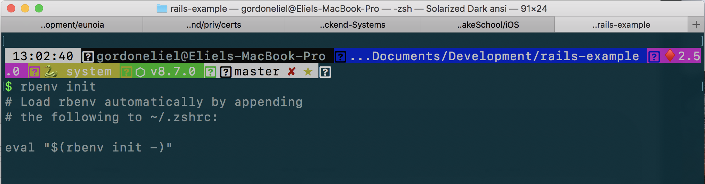

Before we get started building our voice memo app, we will need to setup _Ruby_ - the language we will be writing our app in.

In this section we will need to:

- Install a newer version on Ruby (your mac already has Ruby, but an older version)
- Install rbenv a version manager for Ruby.

# The Ruby Language

## Background

Ruby is the language for writing Rails applications. It has been around since 1985 and has developed an enormous community of developers and enthusiasts. Ruby focuses on developer productivity making the language easy and pleasant to write.

> A dynamic, open source programming language with a focus on simplicity and productivity. It has an elegant syntax that is natural to read and easy to write.

> - ruby-lang.org

You can checkout the Ruby homepage here:

[Ruby Homepage](https://www.ruby-lang.org/en/)

## Installing the latest version of Ruby

macOS comes with ruby 2.7 installed, but it does not allow us to upgrade the version of Ruby. Because of this, it is very common to have different versions of Ruby installed. The _system_ or _global_ Ruby and local Ruby versions. To enable us to have different versions of Ruby installed, we will need to use a language manager. [rbenv](https://github.com/rbenv/rbenv) is a solid choice for managing our Ruby versions.

### Installing rbenv

1. Install rbenv via homebrew:

    ```shell
    brew install rbenv
    ```


2. Initialize rbenv with:

    ```shell
    rbenv init
    ```


3. Copy the output from your terminal and paste it in your terminal profile eg (.bash_profile, .zshrc)

    


4. Verify that rbenv is installed correctly by running:

    ```shell
    curl -fsSL https://github.com/rbenv/rbenv-installer/raw/master/bin/rbenv-doctor | bash
    ```


5. Install the latest version of ruby: 2.5.0

    ```shell
    rbenv install 2.5.0
    ```


6. Set the global ruby version to 2.5.0

  ```shell
  rbenv global 2.5.0
  ```

> [info]
> Running rbenv local 2.5.0 will set your local ruby version to 2.5.0 instead of using the global version and will create a .ruby-version file in your current directory. We will run that command later in the tutorial.

# Ruby Gems

Ruby applications are called _Gems_. If you have ever used cocoapods or fastlane, they both are written in Ruby and are Gems.

We will be installing a few Gems in this tutorial. One of them being the _Rails framework_.

You can search for all Gems on the RubyGems homepage:

[Ruby Gems](https://rubygems.org)

# The Rails Framework

## Background

Rails is a web application development framework written in the Ruby. Rails follows convention over configuration as it makes certain assumptions about what a developer needs to build a web application. This translates to faster development time and a fun development experience.

Because the Rails framework has such an active community, we can find a _Gem_ for just about any functionality we want to add to our web app.

Want to add photo attachments? Setup an API? there is a Gem for that.

## Installing Rails

Install the Rails framework with:

```shell
sudo gem install rails
```

# Summary

Lets go over what we have learnt so far:

- Ruby is the language for writing rails applications
- Packaged Ruby applications are called Gems
- The Rails framework is a Ruby Gem
- Rbenv lets us install and manage different versions of Ruby
