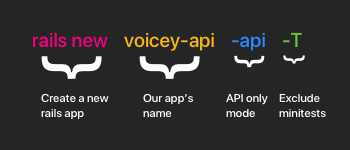
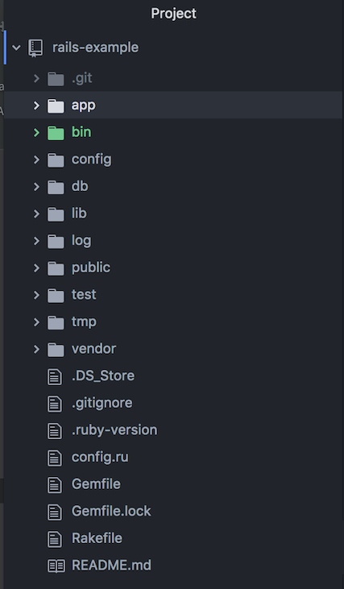
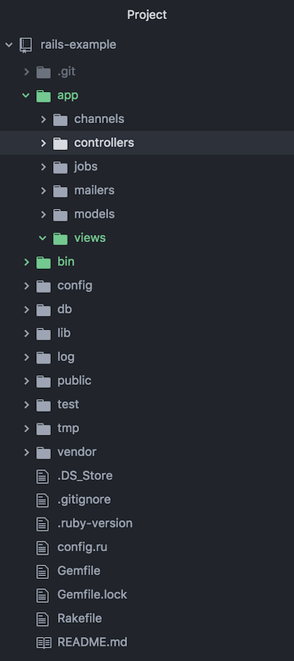
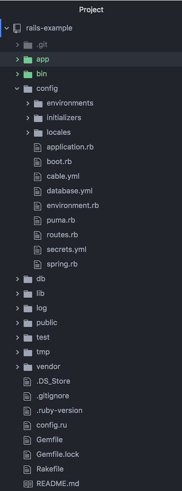

In this section we are going to setup a new rails app, examine the rails app architecture and install some dependencies.

# Setup a new Rails application

1. Lets generate a new Rails project by running:

```shell
rails new voicey-api --api -T
```

2. Then setup your ruby version with rbenv by installing ruby 2.5.0:

```shell
rbenv install 2.5.0
```

3. Change directory to your project

```shell
cd voicey-api
```

4. Set the ruby version to 2.5.0

```shell
rbenv local 2.5.0
```

----

> [info]
> **Breaking down the rails new command**
> 

# Rails Application Structure

Lets go over some of the important files and folders in your rails application.

<!-- ## Overview -->

<!--  -->

## The App Folder

<!--  -->

```
.
├── channels
├── controllers
├── jobs
├── mailers
├── models
└── views
```

The app folder contains the following folders:

- Channels - for websocket communication
- Controllers - Controllers for our app
- Jobs - for running recurring background tasks
- Mailers - for sending emails
- Models - Models for our data
- Views - Views for formatting data

> [info]
> Rails uses the Model View Controller programming pattern and we will be focusing on the Model, View and Controller folders for this tutorial.

## The Config Folder

<!--  -->

```
├── environments
│   ├── development.rb
│   ├── production.rb
│   └── test.rb
├── initializers
│   ├── application_controller_renderer.rb
│   ├── backtrace_silencers.rb
│   ├── cors.rb
│   ├── filter_parameter_logging.rb
│   ├── inflections.rb
│   ├── mime_types.rb
│   └── wrap_parameters.rb
├── locales
│   └── en.yml
├── application.rb
├── boot.rb
├── cable.yml
├── database.yml
├── environment.rb
├── puma.rb
├── routes.rb
├── secrets.yml
└── spring.rb
```

The app folder contains the following:

- Environments - Setup for our enviroments (development, test, production, etc..)
- database.yml - This is where we will setup our databases
- routes.rb - This is where we will add our Restful routes to.
- application.rb - Contains setting for our rails application.

# Model, View, Controller in Rails

Rails uses the MVC pattern for building web applications. The MVC pattern divides the functionality of an application into 3 logical and cooperative components.

The models, views and controllers are found in their folders under the app folder.

## The Model (ActiveRecord)

The _Model_ enables us to map a database table with a Ruby object. It can handle associations, validations, queries and more.

The _Model_ maintains an active relationship with a library called _ActiveRecord_, which Rails uses to manage the relationship with the datbase.

## The View

The _View_ handles the formatting and presentation of data.

In this tutorial, we are using Rails in API only mode, which means we will be rending _JSON_ instead of _HTML_ views.

## The Controller

The _Controller_ is responsible for handling requests. It directs traffic to appropriate functions which coordinates with the _Model_ and the _View_ to render a response.

# Dependencies, Bundler & the Gemfile

## Bundler

Rails uses a Gem called bundler to install and manage its dependencies.

Make sure you have bundler installed by running:

```shell
sudo gem install bundler
```

## The Gemfile

The Gemfile is a file that lists our dependencies for our rails application.
It enables us to manage the Gems that should be installed for each enviroment(production, development, test, etc..).

# Provisioning a database

## Installing Postgres on macOS

We will need to setup a _postgres_ database to use with our app. For this tutorial we will be using postgres.

Follow the instructions here for installing postgres:

[Installing Postgres Link](https://gist.github.com/sgnl/609557ebacd3378f3b72)

## Setup Postgres on Rails

Remove the sqlite gem from your Gemfile and add the following:

```ruby
# Gemfile
gem 'pg'
```

Then run the follow in your terminal:

```shell
bundle install
```

## Database setup

Open the _config/database.yaml_ file and replace the contents with this:

```ruby
development:
  adapter: postgresql
  encoding: unicode
  database: voicey_development
  pool: 5
  username: postgres
  password: postgres

test:
  adapter: postgresql
  encoding: unicode
  database: voicey_test
  pool: 5
  username: postgres
  password: postgres


production:
  adapter: postgresql
  encoding: unicode
  database: voicey_production
  pool: 5
  username: postgres
  password: postgres
```

> [action]
> Make sure to replace the username and password with yours

## Create our database

1. Create the database with:

```shell
rails db:create
```

# Summary

- Rails uses the Model View Controller architecture
- The Gemfile contains all our dependencies
- Bundler is used to install and manage our dependencies
- The database.yaml file contains information on our databases
