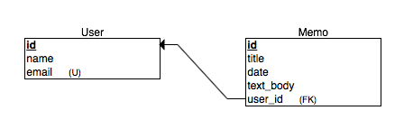

Before we jump into creating our app, lets flesh out the components of our voice memo app.

We will need the following models:

- Memo
  - title
  - time
  - voice_attachement
  - text_body
  - belongs to a user

- User
  - name
  - email
  - password
  - has many memos

## The Entity Relation Diagram

