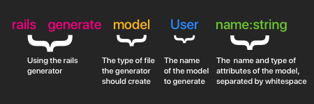
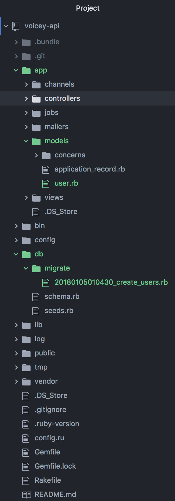
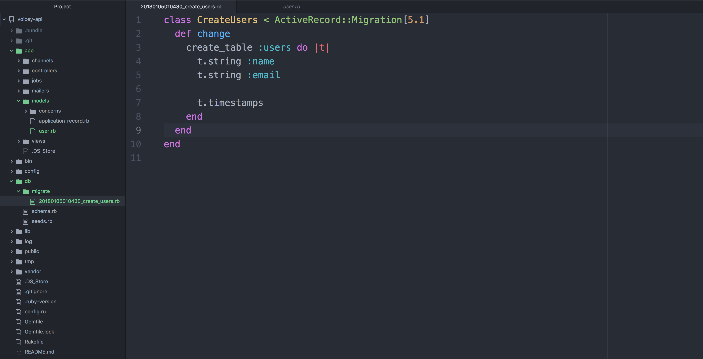
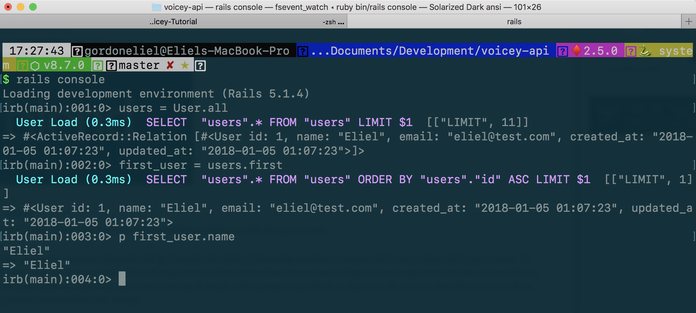

Voicey needs to have users to store Memos. We need to scaffold a basic _User_ model with a name and an email.

# Primer on Rails Generators

Rails uses a lot of command line tools to speed up the process of development. They are optional but are widely used and can save you some development time.

## Generators

Generators enable us to create files quickly. We will use them to create _models, views and controllers_ in this tutorial.

# Creating the User model

Lets start by creating the _User_ model since we will need a way to associate a Memo with a specific _User_.

```ruby
rails generate model User name:string email:string
```

### Breakdown

> [info]
> 
> rails generate model tells rails we want to generate a model called User. The next parametes are the attributes of the model.
eg. rails generate User name:string email:string age:integer

<!--  -->

> [info]
Here is a list of some of the datatypes you can generate:
>
- :primary_key
- :string
- :text
- :integer
- :float
- :decimal
- :datetime
- :timestamp
- :time
- :date
- :binary
- :boolean
- :references

## Generator Files

Lets take a look at the files created by the generator.



It created a _User_ model file under app/models and a _migration_ file under db/migrate.

# Migrations

Migrations write changes to our database. It is describing the changes that are going to be made to the database.

Lets take a look at the migration file created by the rails generator.



For the _User_ migration file, we are creating a brand new table in our database called _users_ with two fields, name a string and email also a string.

> [info]
> Running rails generate model will create both the model file and a migration file to accompany it.
>

# The Schema file

The _schema.rb_ file is located in db folder and describes the schema of your database. All your migration changes should reflect here in one file.

This should be a one-to-one relation to the tables and columns in the database.

# The Rails Console

The Rails Console enables us to inspect our rails app. Think of it as a sort of debugger for running our rails app.

We can run it by executing the following in terminal:

```shell
rails console
```

Lets start by creating a _User_ object and saving it to the database.

Run the following in terminal under rails console:

```ruby
user = User.new
```

Then run in the following commands for our example user in rails console:

1.

```ruby
user.name = "Eliel"
```

2.

```ruby
user.email = "eliel@test.com"
```

3.

```ruby
user.save
```

> [info]
> This will create a new User model and save it to the database
>

## Inspecting our User objects from the database

We can query for objects in the rails console.

Lets fetch all users in our database.

```ruby
users = User.all
```

> [info]
> This fetches all users in our database and puts them in a ruby array. So now users = [User].
> We can print the first user in the array by running:

> 1. first_user = users.first
> 1. puts first_user.name
>

---



# Extra model enhancements

We have just completed creating our _User_ model.

Lets modify it to make the email field unique, that way we cannot insert a _User_ in to the database if there exists a _User_ with the same email.

## Adding a unique field to User

Run this in your terminal:

```ruby
rails generate migration AddIndexToUsers
```

Open the file created by the rails generator.
It should be under db/migrate and should end with add_email_index_to_users.

Paste the following into the change function.

```ruby
add_index :users, :email, unique: true
```

Your migration file shoul look like this:

```ruby
class AddEmailIndexToUsers < ActiveRecord::Migration[5.1]
  def change
    add_index :users, :email, unique: true
  end
end
```

Now run:

```ruby
rails db:migrate
```

> [info]
> Our User model is now unique to emails!
>
