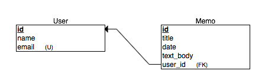

Now that we have created the _Memo_ model, we are going to associate it with a _User_.

A _User_ can have many _Memos_ and but a _Memo_ belongs to only one _User_.

Lets look at how that looks like in the Entity Relation Diagram for our app.



## ActiveRecord Associations

Rails uses _ActiveRecord_ to manage the relationship between the _Model_ and the database.

To create a relationship between the User and Memo we are going to have to create a few migrations.

Run the following in terminal:

```ruby
rails generate migration AddUserToMemos user:references
```

> [info]
> We created a manual migration file when creating Users.
> The difference with this migration is that we specify the relationship directly to the generator.
> Rails infers the Model that the relationship is going to be attached to (Memo) from the _AddUserToMemos_
> The last parameter _user:references_ is attaching the _User_ model as a relationship to _Memo_.
>

```ruby
class AddUserToMemos < ActiveRecord::Migration[5.1]
  def change
    add_reference :memos, :user, foreign_key: true
  end
end
```

> [action]
> Make sure to run rails db:migrate after creating the migration file
>

# Adding Associations to the Models

## Types of Rails Associations

There are many types of associations in Rails:

- belongs_to
- has_many
- has_one
- has_many :through
- has_one :through
- has_and_belongs_to_many

We are going to be using the _belongs_to_ and the _has_many_ in this tutorial.

### Belongs To

A belongs_to association sets up a one-to-one connection with another model. When we use a _belongs_to_ association, we indicate that we (the model) contains the _foreign_key_ of another model.

### Has Many

A has_many association indicates a one-to-many connection with another model. This doesn't use any _foreign_keys_. It simply lets Rails know that there is another model that holds the a _foreign_key_ to itself.

> [info]
> Keeps these associations in mind as we will be using these them in the next section.
>

### Adding Users to Memo

Add the following to your _Memo.rb_ file:

```ruby
belongs_to :user
```

Your _Memo.rb_ file should look like this now:

```ruby
class Memo < ApplicationRecord
  belongs_to :user
end
```

### Adding Memos to User

Add the following to your _User.rb_ file:

```ruby
has_many :memos
```

Your _User.rb_ file should look like this now:

```ruby
class User < ApplicationRecord
  has_many :memos
end
```

## Testing our relationships in the rails console

To test our relationships we will create a User and Memo model in the rails console.

```ruby
user = User.create(
  name: "John",
  email: "john@mail.com"
)
```

Save the user

```ruby
user.save
```

```ruby
memo = Memo.create(
  title: "My Memo",
  time: DateTime.now.utc,
  text_body: "Memo text body",
  user: user
  )
```

Save the memo

```ruby
memo.save
```

If the relationships were setup properly, you should be able to save both the user and the memo.
