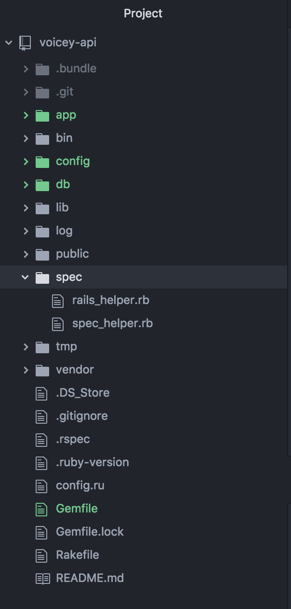
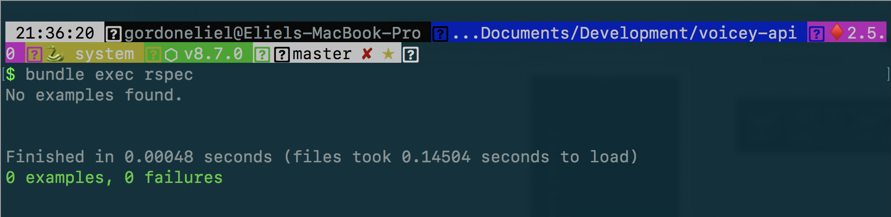

We have written a lot of code in the previous sections of this tutorial. We are going to test what we have written so far.

Lets start with the model tests.

# Testing the Models

Before we get started with testing, we are going to install a few Gems to aid with our testing.

Lets add the following Gems to our Gemfile:

```ruby
# Gemfile

group :test do
  gem 'rspec-rails', '~> 3.7', '>= 3.7.2'
  gem 'database_cleaner', '~> 1.6', '>= 1.6.2'
end
```

Then run:

```shell
bundle install
```

> [info]
> Running bundle install installs the Gems in our Gemfile.

Lets then initialize the _spec/_ directory where specs will reside with:

```ruby
rails generate rspec:install
```

This should create a new folder called _spec_ in the root of our rails application.

```
.
├── app
├── bin
├── config
├── db
├── lib
├── log
├── public
├── spec -- This is new!
├── tmp
├── vendor
├── Gemfile
├── Gemfile.lock
├── README.md
├── Rakefile
└── config.ru
```

<!--  -->

Then run the rails server to make sure everything is working correctly:

```shell
bundle exec rspec
```

You should see something similar to this output in your terminal:



This is great, we haven't written any tests yet. Lets write some tests.

## Writing the tests

Lets write the tests for the _User_ model.

```ruby
rails generate rspec:model User
```

## Attribute Validation

We are going to start by validating model properties.

Replace the line containing:

```ruby
pending "add some examples to (or delete) #{__FILE__}"
```

with:

```ruby
describe "Validations" do
  it "is valid with valid attributes" do
    user = User.new(name: "Eliel", email: "eliel@test.com")
    expect(user).to be_valid
  end

  it "is invalid without a name" do
    bad_user = User.new(name: nil, email: "test@mail.com")
    expect(bad_user).to_not be_valid
  end

  it "is invalid without an email" do
    bad_user = User.new(name: "Eliel", email: nil)
    expect(bad_user).to_not be_valid
  end
end
```

The second and third test should fail, indicating that we did not add any validations to our _User_ model.

Lets add some validations to make sure that a _User_ must have a name and email to be created.

# ActiveRecord Validations

Add the following to the _User_ model, right under the belongs_to:

```ruby
validates :name, presence: true
validates :email, presence: true, uniqueness: true
```

The _User_ model should now look like this:

```ruby
class User < ApplicationRecord
  has_many :memos
  validates :name, presence: true
  validates :email, presence: true, uniqueness: true
end
```

The _validates_ modifier tells _ActiveRecord_ to ensure that the name and email field exists before saving the _User_ model.

Lets test it out.

Run your tests again:

```shell
bundle exec rspec
```

The three (3) tests should pass now.

## Association Validation

Lets test that a _User_ has many _Memos_. Add the following test to our user_spec.rb

```ruby
describe "Associations" do
  it "should have many memos" do
    assoc = User.reflect_on_association(:memos)
    expect(assoc.macro).to eq :has_many
  end
end
```

The final user_spec.rb file should look like this now:

```ruby
require 'rails_helper'

RSpec.describe User, type: :model do
  describe "Validations" do
    it "is valid with valid attributes" do
      user = User.new(name: "Eliel", email: "eliel@test.com")
      expect(user).to be_valid
    end

    it "is invalid without a name" do
      bad_user = User.new(name: nil, email: "test@mail.com")
      expect(bad_user).to_not be_valid
    end

    it "is invalid without an email" do
      bad_user = User.new(name: "Eliel", email: nil)
      expect(bad_user).to_not be_valid
    end
  end

  describe "Associations" do
    it "should have many memos" do
      assoc = User.reflect_on_association(:memos)
      expect(assoc.macro).to eq :has_many
    end
  end
end
```

# Testing Memos

> [challenge]
> Can you write the tests for the Memo model?
> You will have to test for the required Memo attributes as well as the belongs_to association to User.
>

Hint

> [info]
> To create a Memo, you will need to have an existing user. You could create a user once that you could use for all your tests by creating a user in a before block like this:
>
```ruby
before {
  User.new(name: "Eliel", email: "eliel@test.com")
}
```
>

<!--  -->

Rspec Memo Test Solution

> [solution]
>
```ruby
require 'rails_helper'
# Memo Tests
RSpec.describe Memo, type: :model do
  subject {
    User.new(name: "Eliel", email: "eliel@test.com")
  }
  describe "Validations" do
    it "is valid with valid attributes" do
      memo = Memo.new(
        title: "My Memo",
        date: DateTime.now.utc,
        text_body: "This is the text body",
        user: subject
      )
      expect(memo).to be_valid
    end
    it "is invalid without a title" do
      bad_memo = Memo.new(
        title: nil,
        date: DateTime.now.utc,
        text_body: "This is the text body",
        user: subject
      )
      expect(bad_memo).to_not be_valid
    end
    it "is invalid without an time" do
      bad_memo = Memo.new(
        title: "My Memo",
        date: nil,
        text_body: "This is the text body",
        user: subject
      )
      expect(bad_memo).to_not be_valid
    end
    it "is invalid without an text body" do
      bad_memo = Memo.new(
        title: "My Memo",
        date: DateTime.now.utc,
        text_body: nil,
        user: subject
      )
      expect(bad_memo).to_not be_valid
    end
    it "is invalid without a user" do
      bad_memo = Memo.new(
        title: "My Memo",
        date: DateTime.now.utc,
        text_body: nil,
        user: nil
      )
      expect(bad_memo).to_not be_valid
    end
  end
  describe "Associations" do
    it "should have many memos" do
      assoc = Memo.reflect_on_association(:user)
      expect(assoc.macro).to eq :belongs_to
    end
  end
end
```
>

Memo model validation solution:

> [solution]
>
```ruby
class Memo < ApplicationRecord
  belongs_to :user
  validates :title, :date, :text_body, presence: true
end
```
>

# Testing the Controllers

When testing in Rails with rspec, we generally don't tests Controllers by rather write an integration tests to test that a certain request is successful through a controller.

Lets begin writing a request spec for the User Controller.

```ruby
rails generate rspec:request UserController
```

Run only the request tests with:

```ruby
bundle exec rspec spec/requests
```

The request tests should fail.

We will fill in the controller request tests in the next section when we cover authentication.
