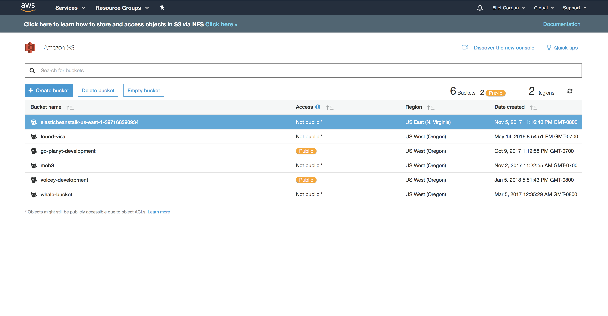
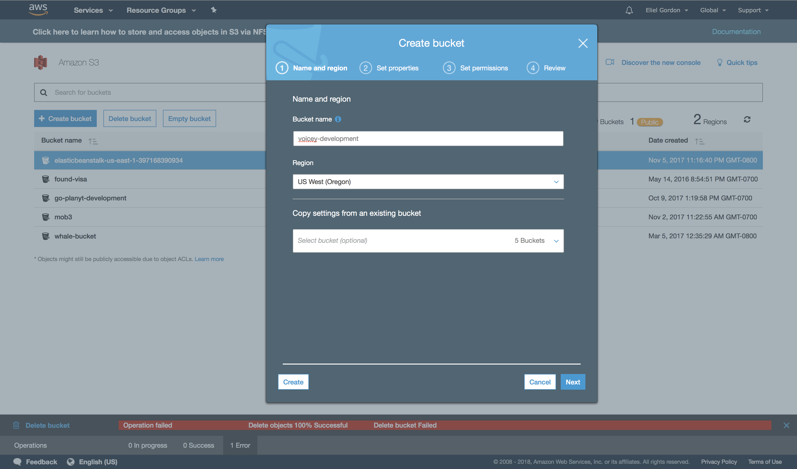
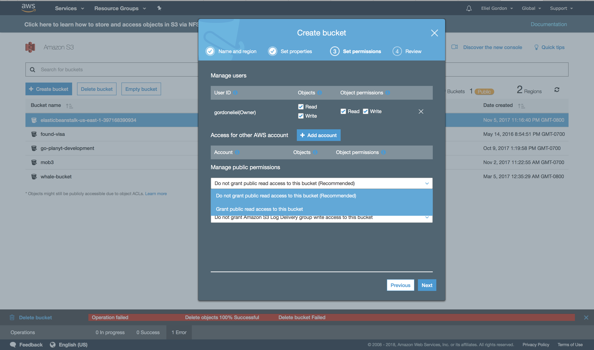

Voicey allows users to add voice memos. So far, we have created and tested our User and Memo resource.

In this section, we are going to add an audio attachment to _Memos_ to enable us to have voice memos.

# Setting up an Amazon s3 account

Before we can upload voice memos, we will need a place to store our audio files. We cannot store the files on the computer that houses our Rails applicaition because is not designed to store lots of large files. Typically, developers will store large files in a content delivery network like Amazon s3 or Google cloud storage then store the url to the resource in a database.

Lets setup an Amazon s3 by signing up for Amazon here:

[Amazon s3 Homepage](https://aws.amazon.com/s3/)

1. Sign up for a new account if you don't have one.

1. Go to the Security Credentials page


1. Create a new IAM credential

1. Save your Access key and Secret

## Adding Buckets

Amazon s3 stores our files in _"buckets"_. Buckets contain related files. An example could be a bucket called voicey-development that will store all the files related to our Rails app.

1. Go to the Amazon s3 Homepage. I have created a few buckets, your bucket list should be empty.


1. Create a new bucket, give it a name and choose Oregon for the region


1. In the next section (Set properties) under manage permissions, set the permissions to "Grant public read access to this bucket"


1. Hit next on the next steps then create your bucket.

> [info]
> Keep the bucket name and region in memory as we will use them for setting up s3 on Rails.
>

# Using Paperclip

Paperclip is a Ruby Gem that enables us to have attachments to Rails models.

You can use it have audio, pdf, image, and video attachments.

You can take a look at the documentation here:

[Paperclip Homepage](https://github.com/thoughtbot/paperclip)

We will also be storing all our audio files in Amazon s3. We will go over creating an account on Amazon soon.

Lets add the paperclip and AWS-SDK Gem to our Gemfile:

```ruby
# Gemfile
gem 'paperclip', '~> 5.1'
gem 'aws-sdk', '~> 2.3.0'
```

## ImageMagick

Paperclip uses _ImageMagick_ so we have to install it:

```shell
brew install imagemagick
```

Now generate the migration for paperclip with:

```shell
rails generate paperclip memo voice_file
```

> [action]
> Run rails db:migrate
>

Add this configuration file to the _application.rb_ file in _config_ folder.

```ruby
config.paperclip_defaults = {
  storage: :s3,
  s3_credentials: {
    bucket: ENV.fetch('S3_BUCKET_NAME'),
    access_key_id: ENV.fetch('AWS_ACCESS_KEY_ID'),
    secret_access_key: ENV.fetch('AWS_SECRET_ACCESS_KEY'),
    s3_region: ENV.fetch('AWS_REGION')
  }
}
```

Your application.rb file should now look like this:

```ruby
require_relative 'boot'

require "rails"
# Pick the frameworks you want:
require "active_model/railtie"
require "active_job/railtie"
require "active_record/railtie"
require "action_controller/railtie"
require "action_mailer/railtie"
require "action_view/railtie"
require "action_cable/engine"

Bundler.require(*Rails.groups)

module VoiceyApi
  class Application < Rails::Application

    config.load_defaults 5.1

    config.paperclip_defaults = {
      storage: :s3,
      s3_credentials: {
        bucket: ENV.fetch('S3_BUCKET_NAME'),
        access_key_id: ENV.fetch('AWS_ACCESS_KEY_ID'),
        secret_access_key: ENV.fetch('AWS_SECRET_ACCESS_KEY'),
        s3_region: ENV.fetch('AWS_REGION')
      }
    }

    config.api_only = true
  end
end
```

## Setting our environment variables

Since the configuration for paperclip requires that we setup a few environment variables, we are going to have to set them in our terminal session.

Lets create a file called _.env_ in the root directory of our app and add it to the gitignore. It is going to house our credentials for Amazon s3.

```shell
touch .env
```

Open the _.env_ file. This should be the contents of the _.env_ file. Paste in your s3 bucket name, region, aws access key id and aws secret key.

```ruby
export S3_BUCKET_NAME="your bucket name"
export AWS_ACCESS_KEY_ID="your access key id"
export AWS_SECRET_ACCESS_KEY="your secret access key"
export AWS_REGION="us-west-2"
```

We are going to load the environment variables set in the _.env_ files to our bash session.
We can do that by running the following command in terminal:

```shell
source .env
```

> [action]
> Run the rails server to verify that our Rails app is working
>

## Model Attachments

Then add the following code to your _Memo_ model.

```ruby
has_attached_file :voice_file
validates_attachment :voice_file, :content_type =>['audio/mpeg', 'audio/x-mpeg', 'audio/mp3', 'audio/x-mp3', 'audio/mpeg3', 'audio/x-mpeg3', 'audio/mpg', 'audio/x-mpg', 'audio/x-mpegaudio']
```

Your _Memo_ model should now contain the following:

```ruby
class Memo < ApplicationRecord
  belongs_to :user
  validates_presence_of :title, :date, :text_body, :user
  has_attached_file :voice_file, default_url: "/voice_memos/empty/empty.mp3"
  validates_attachment :voice_file, content_type: { content_type: ['audio/mpeg', 'audio/x-mpeg', 'audio/mp3', 'audio/x-mp3', 'audio/mpeg3', 'audio/x-mpeg3', 'audio/mpg', 'audio/x-mpg', 'audio/x-mpegaudio']}
end
```

## Updating the Memo controller

We need to update the memo controller to account for adding the _voice_file_ attachment to _Memos_.

Replace the folling line in the _memo_params_ function in the _memo_ _ _controller.rb_ file.

```ruby
params.permit(:voice_file, :title, :text_body, :date)
```

Your memo controller should know look like this:

```ruby
class MemosController < ApplicationController
  before_action :set_memo, only: [:show, :update, :destroy]

  # GET /memos
  def index
    @memos = Memo.all

    render json: @memos
  end

  # GET /memos/1
  def show
    render json: @memo
  end

  # POST /memos
  def create
    @memo = Memo.new(memo_params)

    if @memo.save
      render json: @memo, status: :created, location: @memo
    else
      render json: @memo.errors, status: :unprocessable_entity
    end
  end

  # PATCH/PUT /memos/1
  def update
    if @memo.update(memo_params)
      render json: @memo
    else
      render json: @memo.errors, status: :unprocessable_entity
    end
  end

  # DELETE /memos/1
  def destroy
    @memo.destroy
  end

  private
    # Use callbacks to share common setup or constraints between actions.
    def set_memo
      @memo = Memo.find(params[:id])
    end

    # Only allow a trusted parameter "white list" through.
    def memo_params
      params.permit(:voice_file, :title, :text_body, :date)
    end
end
```

# Serializing our JSON responses

Because we need to render the URL for our memo files, we will need to create a custom JSON serializer for our _Memo_ model.

Serializers enable us to specify which properties we want to render.

1. Add the ActiveModel serializer Gem to our Gemfile and run bundle install.

```ruby
gem 'active_model_serializers'
```

1. Run:

```shell
rails g serializer memo
```

1. Add the following code to the memo_serializer.rb file under the class definition:

```ruby
attributes :id, :title, :text_body, :date, :voice_file_url

def voice_file_url
  object.voice_file.url()
end
```

Our memo_serializer.rb file should look like this now:

```ruby
class MemoSerializer < ActiveModel::Serializer
  attributes :id, :title, :text_body, :time, :voice_file_url

  def voice_file_url
    object.voice_file.url()
  end
end
```

> [info]
> In the third step, we extract the storage url(s3) from paperclip and add it as a JSON field for rendering
>

Great! Now our app handles audio attachments to the _Memo_ model.

# Testing the audio attachments

Lets test the audio upload functionality by writing some model and controller tests for _Memo_.
