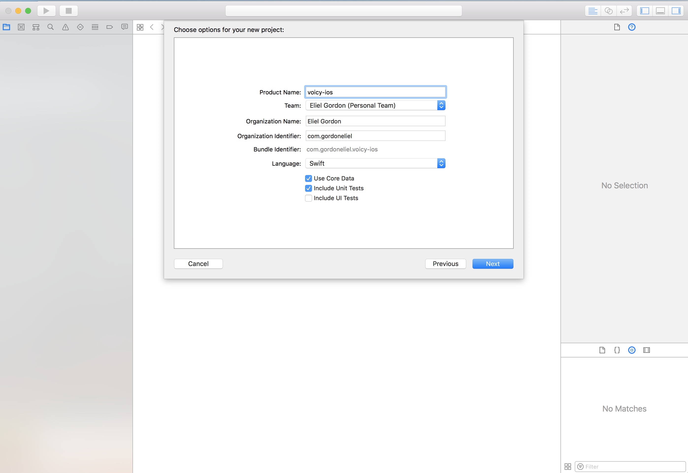

In the previous sections we built a rails server for Voicey. This API handles signing in, account creation and the ability to create voice memos.

In this next sections, we are going to create an iOS app that will consume our API.

# Creating an iOS App for Voicey

Create a new Xcode project and give it a name.



## Project breakdown

Lets breakdown the components of the app we have to build.

- We need a way to handle account creation and login.
- Display a list of users's memos
- Preview a selected memo and play the associated voice file if there is any (Memos don't have to have a voice attachment).
- A way to create a new memo
- A way to edit an existing memo

Now that we have a game plan on what to build, lets get started by building views for our application.

Lets start by cloning the started project repo:

[Voicey iOS Starter Project](https://github.com/Product-College-Labs/voicey-ios-starter)

# Structure of the starter project

```bash
|-voicy-ios.xcodeproj
  |-voicy-ios
  |  |-UI
  |  |  |-Cells
  |  |  |-Scenes
  |  |  |  |-AppDelegateScene
  |  |  |  |-MemoScene
  |  |  |  |  |-ViewControllers
  |  |  |  |-AuthenticationScene
  |  |  |  |  |-ViewControllers
  |  |-Networking
  |  |  |-APIClients
  |  |  |-Models
  |  |-Assets.xcassets
  |  |  |-AppIcon.appiconset
  |  |-Extensions
  |  |-voicy_ios.xcdatamodeld
  |  |  |-voicy_ios.xcdatamodel
  |-voicy-iosTests
```

# Creating models for our Memo and User objects

We will need JSON models for decoding our user and memo objects from our api.

> [challenge]
> Create JSON models for User and Memo under the Networking/Models folder.
>

# Summary
