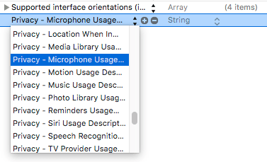

# Recording Audio with AVFoundation

Lets encapsulate the functionality of playing and recording audio files.

Create a new file called AudioHandler.swift in the AudioHandler folder.

Copy the following into the AudioHandler.swift file:

```swift
// 1. Setup audio recorder
var recorder: AVAudioRecorder?

// 2. Specify mp3 format for recording audio and medium quality
let recorderSetting: [String: Any] = [
    AVFormatIDKey: kAudioFormatMPEGLayer3,
    AVEncoderAudioQualityKey: AVAudioQuality.medium
]

// 3. Recording output path
let audioOutputBasePath = try! FileManager.default.url(
    for: .documentDirectory,
    in: .userDomainMask,
    appropriateFor: nil,
    create: false
)

// 4. Extension for mp3 file
let fileExtension = ".mp3"

func prepareRecorder() {
    // 4. Create a unique id for our audio file and add mp3 extension
    let fileName = UUID().uuidString

    let outputFileURL = audioOutputBasePath
        .appendingPathComponent(fileName)
        .appendingPathExtension(fileExtension)

    guard let recorder = try? AVAudioRecorder(
        url: outputFileURL,
        settings: recorderSetting
        ) else {return}

    self.recorder = recorder

    recorder.delegate = self
    recorder.prepareToRecord()
}

func startRecording() {
    recorder.record()
}

func stopRecording() {
    recorder.stop()
}
```

Whats happening in this file?

> [info]
> We setup an audio recorder with AVFoundation. Specify the type of audio file (.mp3) and the quality of the audio - we use medium quality so we don't end up uploading large files.

> We then specify an output for our recorded files. They will live in the documents documentDirectory in the app's Document Container.

> The prepareToRecord function creates a unique id for our audio file and sets up the recorder to record.
>

Next add this extension to AudioHandler.swift:

```swift
extension AudioHandler: AVAudioRecorderDelegate {
    // 5. Called when we are done recording
    func audioRecorderDidFinishRecording(_ recorder: AVAudioRecorder, successfully flag: Bool) {

    }
}
```

This will handle the output from recording.

# Adding an Audio Player

Lets extend the functionality of the AudioHandler to include playing audio files as well. Add this to the AudioHandler.

```swift
var player: AVAudioPlayer?

func playAudio(voiceURL: URL) {
    player = try? AVAudioPlayer(contentsOf: voiceURL)
    player?.play()
}

func stopAudio() {
    player?.stop()
}
```

What is happening here?

> [info]
> We setup an audio player to play an audio file from a specific URL

> We also create helper functions to play and stop the audio
>

# Setting audio recording permissions

To record audio from a user's device on iOS, we will need to ask for permission.

Lets add the audio recording permission to our info.plist file.



# Summary

- AVFoundation has functionality to record and play audio files.
- When recording audio files, we will need to store them in a temporary location to be uploaded later on.
